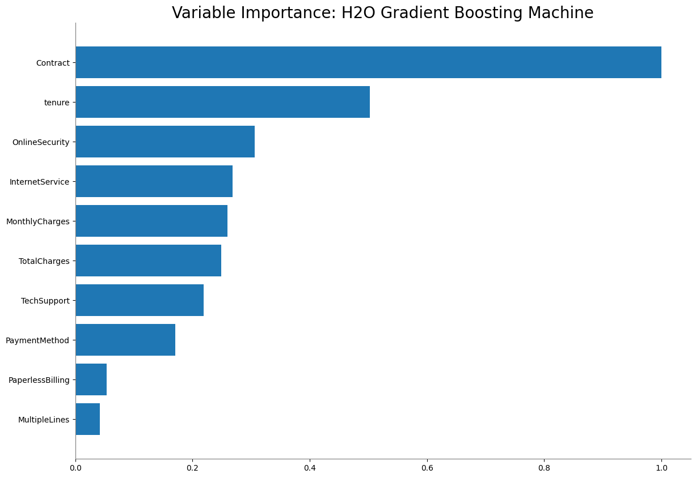
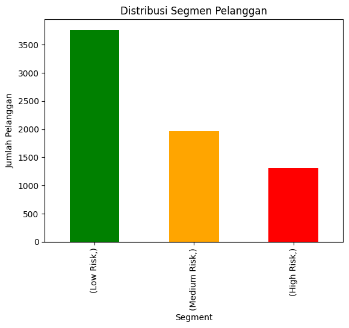

# Telco Customer Churn Prediction

This project demonstrates a machine learning workflow to predict customer churn in a telecommunications dataset using H2O's AutoML. It covers data loading,  model training, evaluation, feature importance, customer segmentation, and visualization.

## Project Overview
- Dataset: Telco Customer Churn (Kaggle)
- Tools: Python, H2O.ai, Google Colab
- Best Model: Stacked Ensemble (AUC = 0.85)
- Key Features: Contract, Tenure, Online Security
- Segmentation: 1,315 High Risk, 1,967 Medium Risk, 3,761 Low Risk

## Results
### Model Leaderboard
(AUC ~0.85, Stacked Ensemble best)

### Feature Importance

### Customer Segmentation

## Business Insights
- Month-to-month contracts → rawan churn, target promo upgrade.
- Tenure pendek → perlu onboarding/loyalty program.
- Tanpa online security → peluang upsell bundling.

## How to Run
1. Clone repo
2. Install requirements (`pip install h2o kaggle`)
3. Run notebook in Colab

## Next Steps
- Deploy model for real-time scoring
- Integrate with BI dashboard
- Evaluate retention strategies based on segments
